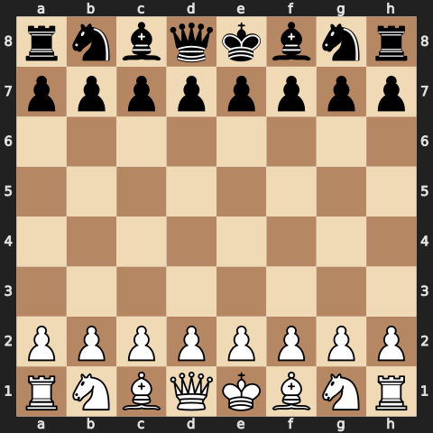

## Kronten28's Community Chess Tournament

**Game in progress.** This is open to **anyone** to play the next move. That's the point!

> **Game #1** | **White's turn** | **Move 0** | **0 total moves** across all games

  

### **White's move** — click a link to make your move!

| Piece | From | Available Moves |
| :---: | :---: | --- |
| ♞ Knight | **B1** | [Nc3](https://github.com/Kronten28/Kronten28/issues/new?title=chess%7Cmove%7Cb1c3%7C1&body=Just%20push%20%27Submit%20new%20issue%27.%20You%20don%27t%20need%20to%20do%20anything%20else.) , [Na3](https://github.com/Kronten28/Kronten28/issues/new?title=chess%7Cmove%7Cb1a3%7C1&body=Just%20push%20%27Submit%20new%20issue%27.%20You%20don%27t%20need%20to%20do%20anything%20else.) |
| ♞ Knight | **G1** | [Nh3](https://github.com/Kronten28/Kronten28/issues/new?title=chess%7Cmove%7Cg1h3%7C1&body=Just%20push%20%27Submit%20new%20issue%27.%20You%20don%27t%20need%20to%20do%20anything%20else.) , [Nf3](https://github.com/Kronten28/Kronten28/issues/new?title=chess%7Cmove%7Cg1f3%7C1&body=Just%20push%20%27Submit%20new%20issue%27.%20You%20don%27t%20need%20to%20do%20anything%20else.) |
| ♟ Pawn | **A2** | [a3](https://github.com/Kronten28/Kronten28/issues/new?title=chess%7Cmove%7Ca2a3%7C1&body=Just%20push%20%27Submit%20new%20issue%27.%20You%20don%27t%20need%20to%20do%20anything%20else.) , [a4](https://github.com/Kronten28/Kronten28/issues/new?title=chess%7Cmove%7Ca2a4%7C1&body=Just%20push%20%27Submit%20new%20issue%27.%20You%20don%27t%20need%20to%20do%20anything%20else.) |
| ♟ Pawn | **B2** | [b3](https://github.com/Kronten28/Kronten28/issues/new?title=chess%7Cmove%7Cb2b3%7C1&body=Just%20push%20%27Submit%20new%20issue%27.%20You%20don%27t%20need%20to%20do%20anything%20else.) , [b4](https://github.com/Kronten28/Kronten28/issues/new?title=chess%7Cmove%7Cb2b4%7C1&body=Just%20push%20%27Submit%20new%20issue%27.%20You%20don%27t%20need%20to%20do%20anything%20else.) |
| ♟ Pawn | **C2** | [c3](https://github.com/Kronten28/Kronten28/issues/new?title=chess%7Cmove%7Cc2c3%7C1&body=Just%20push%20%27Submit%20new%20issue%27.%20You%20don%27t%20need%20to%20do%20anything%20else.) , [c4](https://github.com/Kronten28/Kronten28/issues/new?title=chess%7Cmove%7Cc2c4%7C1&body=Just%20push%20%27Submit%20new%20issue%27.%20You%20don%27t%20need%20to%20do%20anything%20else.) |
| ♟ Pawn | **D2** | [d3](https://github.com/Kronten28/Kronten28/issues/new?title=chess%7Cmove%7Cd2d3%7C1&body=Just%20push%20%27Submit%20new%20issue%27.%20You%20don%27t%20need%20to%20do%20anything%20else.) , [d4](https://github.com/Kronten28/Kronten28/issues/new?title=chess%7Cmove%7Cd2d4%7C1&body=Just%20push%20%27Submit%20new%20issue%27.%20You%20don%27t%20need%20to%20do%20anything%20else.) |
| ♟ Pawn | **E2** | [e3](https://github.com/Kronten28/Kronten28/issues/new?title=chess%7Cmove%7Ce2e3%7C1&body=Just%20push%20%27Submit%20new%20issue%27.%20You%20don%27t%20need%20to%20do%20anything%20else.) , [e4](https://github.com/Kronten28/Kronten28/issues/new?title=chess%7Cmove%7Ce2e4%7C1&body=Just%20push%20%27Submit%20new%20issue%27.%20You%20don%27t%20need%20to%20do%20anything%20else.) |
| ♟ Pawn | **F2** | [f3](https://github.com/Kronten28/Kronten28/issues/new?title=chess%7Cmove%7Cf2f3%7C1&body=Just%20push%20%27Submit%20new%20issue%27.%20You%20don%27t%20need%20to%20do%20anything%20else.) , [f4](https://github.com/Kronten28/Kronten28/issues/new?title=chess%7Cmove%7Cf2f4%7C1&body=Just%20push%20%27Submit%20new%20issue%27.%20You%20don%27t%20need%20to%20do%20anything%20else.) |
| ♟ Pawn | **G2** | [g3](https://github.com/Kronten28/Kronten28/issues/new?title=chess%7Cmove%7Cg2g3%7C1&body=Just%20push%20%27Submit%20new%20issue%27.%20You%20don%27t%20need%20to%20do%20anything%20else.) , [g4](https://github.com/Kronten28/Kronten28/issues/new?title=chess%7Cmove%7Cg2g4%7C1&body=Just%20push%20%27Submit%20new%20issue%27.%20You%20don%27t%20need%20to%20do%20anything%20else.) |
| ♟ Pawn | **H2** | [h3](https://github.com/Kronten28/Kronten28/issues/new?title=chess%7Cmove%7Ch2h3%7C1&body=Just%20push%20%27Submit%20new%20issue%27.%20You%20don%27t%20need%20to%20do%20anything%20else.) , [h4](https://github.com/Kronten28/Kronten28/issues/new?title=chess%7Cmove%7Ch2h4%7C1&body=Just%20push%20%27Submit%20new%20issue%27.%20You%20don%27t%20need%20to%20do%20anything%20else.) |

Share this game: [Post on X (Twitter)](https://x.com/intent/tweet?text=I%27m%20playing%20chess%20on%20a%20GitHub%20Profile%20README%21%20Can%20you%20please%20take%20the%20next%20move%20at%20https%3A//github.com/Kronten28/Kronten28)

<strong>How does this work?</strong>

When you click a move link, it opens a GitHub Issue with a pre-filled title. Just click **"Submit new issue"** — that's it! A [GitHub Action](https://github.blog/2020-07-03-github-action-hero-casey-lee/#getting-started-with-github-actions) will process your move, update the board SVG, and refresh this README automatically.

Notice a problem? [Raise an issue](https://github.com/Kronten28/Kronten28/issues) and tag `@Kronten28`.

---

#### Last 5 moves

*No moves yet — be the first!*

#### Top 20 players

*No moves yet — make a move to claim the top spot!*
